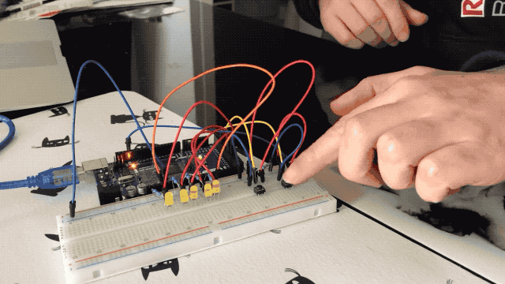
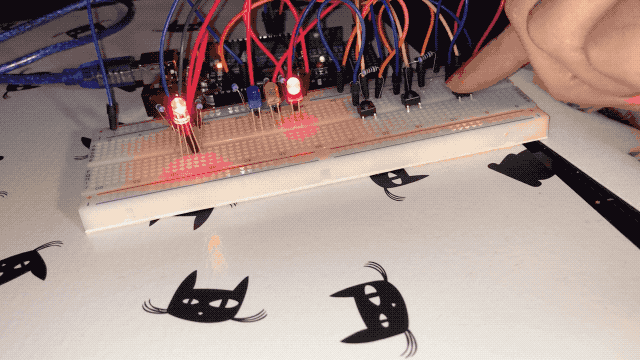

# My playground on Arduino MEGA 2560 and Arduino IDE

This workspace is desgin with few projects on Arduino MEGA 2560.

There are two projets, they were created with Arduino IDE.

## Mono-indicator manager

[Show source code](https://github.com/chris-scientist/ard-workspace/tree/master/ArduinoMega2560/ArdIndicator)

## RGB LED manager

[Show source code](https://github.com/chris-scientist/ard-workspace/tree/master/ArduinoMega2560/ArdManagerRgbLed)

## Note

More details on each project in `.ino` file (see the comment).
